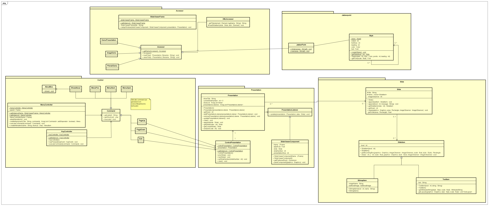

# JabberPoint
## Analyse
De analyse van de originele software is te vinden in het [Analyse pdf-bestand](Analyse.pdf).
## Advies
Het gegeven advies op basis van deze analyse is te vinden in het [Advies pdf-bestand](Advies.pdf).
## Herontwerp
Voor het herontwerp is er een klassendiagram gemaakt, deze is te zien hieronder:

Deze is ook te vinden in het [Astah-bestand](Herontwerp.asta), verder staan hier ook de diagrammen in uit het analyse.
## OTAP
Versiebeheer wordt gedaan via Github en er wordt gebruik gemaakt van Github actions voor een OTAP straat. De github actions staan onder de [workflows](.github/workflows/). Het ontwerp voor de github actions staan onder het [OTAP pdf-bestand](OTAP.pdf).
### Develop
Op deze branch wordt actief gewerkt aan het aanpassen en updaten van code. De github actions die doorlopen worden zijn:
1. Unit Tests uitvoeren (Push & Pull Request)
2. Styles Checken (Push)
3. Maken van een Jar bestand (Pull Request)

Als een van deze stappen niet volledig voltooid is wordt er een issue aangemaakt.
### Test
Deze branch is puur bedoelt voor het testen van het programma. De stappen die doorlopen worden zijn hetzelfde als in Develop.
### Acceptance
Deze branch bevat de laatste release versie. Hier worden de laatste checks gedaan of het programma wel voldoet aan criteria. De github actions die doorlopen worden zijn:
1. Unit Tests uitvoeren (Push & Pull Request)
2. Styles Checken (Push)
3. Maken van een Jar bestand (Push & Pull Request)
4. Een release uitbrengen op basis van de Jar bestand (Push & Pull Request)

Als een van deze stappen niet volledig voltooid is wordt er een issue aangemaakt.
### Production
Production bevat de laatste versie en is ook protected. Er kan niet direct naar gepusht worden. Deze branch bevat de laatste release version en doorloopt dezelfde github actions als Acceptance.
## Tests
Alle stukken code wat testbaar is worden getest door middel van JUnit. De tests zijn te vinden onder de [tests-folder](tests/main/java/)
## Programma
### Software
De JabberPoint Software is een presentatie programma geschreven in Java door middel van Maven. De dependencies hiervan zijn te vinden in de [Pom-file](pom.xml). Het programma is te gebruiken via de `.jar` bestand onder de releases.
### Design Patterns
#### Command Pattern
De command pattern is geïmplementeerd voor de [MenuController](src/main/java/Control/MenuController.java) en [KeyController](src/main/java/Control/KeyController.java) die commands aanroepen via de [Command-interface](src/main/java/Control/Command.java). Alle commando's zijn te vinden onder de [Commands package](src/main/java/Control/Commands/).
#### Singleton Pattern
De singleton pattern is toegepast omdat een aantal klasses slechts 1 keer bestaan in de software en geen toegevoegte waarde hebben om meerdere keren geïnstantieerd te worden. Ook geeft dit makkelijkere toegang tot deze objecten voor andere componenten.\
De singleton klasses zijn: [SlideViewerFrame](src/main/java/Accessor/SlideViewerFrame.java), [ControlPresentation](src/main/java/Presentation/ControlPresentation.java), [MenuController](src/main/java/Control/MenuController.java) en [KeyController](src/main/java/Control/KeyController.java). Ze worden allemaal aangeroepen met hun statische `getInstance()` methodes.
#### Observer Pattern
De observer pattern is toegevoegd om de [Presentation](src/main/java/Presentation/Presentation.java) en [SlideViewerComponent](src/main/java/Presentation/SlideViewerComponent.java) onafhankelijk van elkaar te maken. De SlideViewerComponent is nu geïmplementeerd uit de [PresentationListener-interface](src/main/java/Presentation/PresentationListener.java) waaruit de SlideViewerComponent informatie van de Presentation verkrijgt met de `update(Presentation, Slide)` methode.
#### Facade Pattern
De facade pattern is toegepast via de presentatie demo's. Er zijn 3 demo's beschrikbaar voor developers en gebruikers, namelijk: [DemoPresentation](src/main/java/Accessor/DemoPresentation.java), [ImageDemo](src/main/java/Accessor/ImageDemo.java) en [PlenairDemo](src/main/java/Accessor/PlenairDemo.java). Deze demo's zijn toegankelijk via de Demo menu.
### Principles
#### Single-Responsibility Principle
Deze principle is toegepast door de Observer Pattern toe te passen op de [SlideViewerComponent](src/main/java/Presentation/SlideViewerComponent.java), zodat deze onafhankelijk is van [Presentation](src/main/java/Presentation/Presentation.java). Verder is er een [ControlPresentation](src/main/java/Presentation/ControlPresentation.java) toegevoegd zodat niet elk object een reference nodig is naar de Presentation en ook niet alles door de Presentation gemanaged wordt.
#### Open-Closed Principle
Door de Command Pattern toe te passen aan de [MenuController](src/main/java/Control/MenuController.java) en [KeyController](src/main/java/Control/KeyController.java) is het programma veel meer uitbreidbaar. Het is makkelijk om nieuwe commando's toe te voegen en hoef je niet diep de code van de MenuController of KeyController in te gaan.\
Verder zijn er access modifiers aangepast tegenover het origineel om het programma iets veiliger te maken. Waaronder de fields van [Style](src/main/java/Jabberpoint/Style.java), maar ook de private constructors van de singletons zorgen voor meer veiligheid.
#### Liskov Substitution Principle
Deze principle is toegepast door de verschillende interfaces en abstracte klasses correct te gebruiken.\
De interfaces zijn: [Command](src/main/java/Control/Command.java) en [PresentationListener](src/main/java/Presentation/PresentationListener.java), dezen worden toegepast door de Command en Observer Pattern respectievelijk.\
De abstracte klasses zijn: [Accessor](src/main/java/Accessor/Accessor.java) en [SlideItem](src/main/java/Slide/SlideItem.java), dezen worden toegepast door de klasses binnen hun packages.
#### Dependency Inversion Principle
Zoals al een paar keer eerder benoemd hierboven is deze principle toegepast door de [Presentation](src/main/java/Presentation/Presentation.java) en [SlideViewerComponent](src/main/java/Presentation/SlideViewerComponent.java) onafhankelijk van elkaar te maken. Ook heeft de Singleton Pattern hier veel mee te maken. Het zorgt er voor dat belangrijke componenten toegankelijk zijn en onafhankelijk zijn.